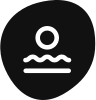

  

  

---

  
Quick Links

  

    

      
    

  

---

<a href="#purpose">Purpose</a> · <a href="#tech-stack">Tech Stack</a>

# Native Owned Businesses

## 🌎 Purpose

The purpose of this project is to build an extensive directory of Native/Indigenous-owned businesses that anyone can contribute to while also providing a first-class search experience that is Native-centric. Users should be able to search based on territory, language, and Nation.

## 💻 Tech Stack

The app is built upon Netlify CMS to make infrastructure and other technical decisions as simple as possible.

